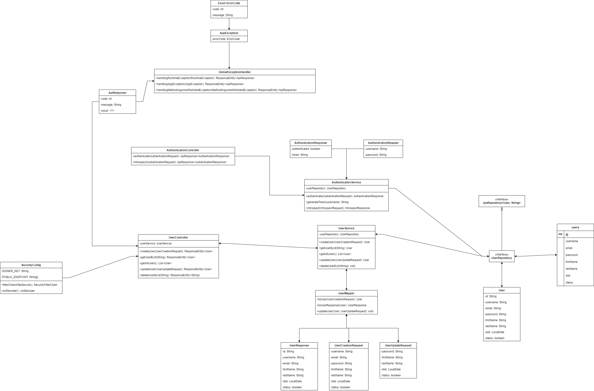
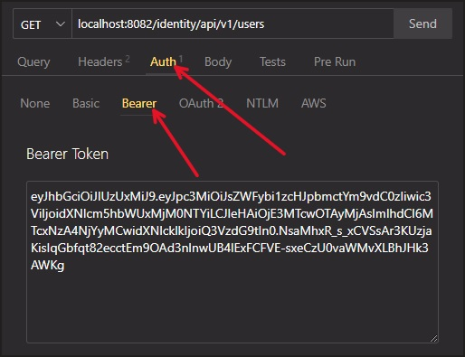

# Hướng dãn cấu hình để xác thực với JWT

## Sơ đồ



## Cấu trúc thư mục

```bash
    +---src
    |   +---main
    |   |   +---java
    |   |   |   \---com
    |   |   |       \---learnspringboot
    |   |   |           \---identity_user
    |   |   |               |   IdentityUserApplication.java
    |   |   |               |
    |   |   |               +---configuration
    |   |   |               |       SecurityConfig.java
    |   |   |               |
    |   |   |               +---controller
    |   |   |               |       AuthenticationController.java
    |   |   |               |       UserController.java
    |   |   |               |
    |   |   |               +---dto
    |   |   |               |   +---request
    |   |   |               |   |       AuthenticationRequest.java
    |   |   |               |   |       IntrospectRequest.java
    |   |   |               |   |       UserCreationRequest.java
    |   |   |               |   |       UserUpdateRequest.java
    |   |   |               |   |
    |   |   |               |   \---response
    |   |   |               |           ApiResponse.java
    |   |   |               |           AuthenticationResponse.java
    |   |   |               |           IntrospectResponse.java
    |   |   |               |           UserResponse.java
    |   |   |               |
    |   |   |               +---entity
    |   |   |               |       User.java
    |   |   |               |
    |   |   |               +---exception
    |   |   |               |       AppException.java
    |   |   |               |       ErrorCode.java
    |   |   |               |       GlobalExceptionHandler.java
    |   |   |               |
    |   |   |               +---mapper
    |   |   |               |       UserMapper.java
    |   |   |               |
    |   |   |               +---repository
    |   |   |               |       UserRepository.java
    |   |   |               |
    |   |   |               \---service
    |   |   |                       AuthenticationService.java
    |   |   |                       UserService.java
    |   |   |
    |   |   \---resources
    |   |       |   application.yml
    |   |       |
    |   |       +---static
    |   |       \---templates
```

## Dependencies

* Spring Web
* Spring Data JPA
* MySQL Driver
* OpenAPI
* Lombok
* Mapstruct
* Lombok Binding Mapstruct
* Spring Security Crypto
* Nimbus JOSE+JWT
* Spring Boot Starter OAuth2 Resource Server (Thêm mới)

## Đặt vấn đề

Hiện tại thì ai cũng có thể truy cập tất cả các endpoint của chúng ta, nghĩa là bất cứ ai cũng có thể xem danh sách `users`, ai cũng có thể thêm, sửa, xóa `user`. 

Trên thực tế, `user` muốn thao tác như vậy cần phải đăng nhập, cần phải được xác thực.

Việc các endpoint không được bảo vệ sẽ dẫn đến một số rủi ro bảo mật như sau:


* Thiếu Bảo Vệ Truy Cập: Các endpoint không được bảo vệ có thể bị truy cập bởi bất kỳ ai, dẫn đến nguy cơ bị tấn công từ các attacker.

* Quản Lý Phiên Làm Việc Kém: Không có cơ chế quản lý phiên làm việc (session management) hiệu quả, dễ dẫn đến các vấn đề như session hijacking.

* Thiếu Kiểm Soát Truy Cập: Không thể kiểm soát truy cập dựa trên vai trò (role-based access control) và quyền hạn (permissions) của người dùng.

* Nguy Cơ Tấn Công CSRF (Cross-Site Request Forgery): Thiếu bảo vệ chống lại các cuộc tấn công CSRF, nơi attacker có thể thực hiện các hành động thay mặt người dùng hợp lệ.

* Không Có Cơ Chế Xác Thực: Không có cơ chế xác thực và ủy quyền, dẫn đến việc không thể đảm bảo rằng người dùng là ai họ tuyên bố và họ có quyền truy cập tài nguyên nào.

* Thiếu Ghi Nhận và Kiểm Toán: Không có cơ chế ghi nhận và kiểm toán các hoạt động truy cập và hành động của người dùng, khó khăn trong việc phát hiện và điều tra các hành vi bất thường hoặc tấn công.

## Giải pháp

### Sử Dụng Spring Security Để Xác Thực Với JWT


Dưới đây là giải thích chi tiết về luồng xác thực trong Spring Security dựa trên hình ảnh:

1. Người dùng (Actor): Người dùng bắt đầu quá trình xác thực bằng cách cung cấp thông tin đăng nhập (tên người dùng và mật khẩu).

2. UsernamePasswordAuthenticationToken: Thông tin đăng nhập của người dùng được chuyển thành một UsernamePasswordAuthenticationToken.

3. Security Filter Chains: Token xác thực này đi qua các chuỗi bộ lọc bảo mật (Security Filter Chains). Các bộ lọc này xử lý các yêu cầu HTTP và xác định xem chúng có cần xác thực hay không.

4. AuthenticationManager: Bộ lọc bảo mật chuyển token xác thực đến AuthenticationManager để xử lý.

5. AuthenticationProvider: AuthenticationManager chuyển tiếp yêu cầu xác thực đến AuthenticationProvider cụ thể. Nhà cung cấp xác thực này chịu trách nhiệm xác thực thông tin đăng nhập của người dùng.

6. PasswordEncoder: AuthenticationProvider sử dụng PasswordEncoder để mã hóa mật khẩu và so sánh với mật khẩu đã mã hóa được lưu trữ.

7. UserDetailsService: Nếu mật khẩu hợp lệ, AuthenticationProvider sẽ sử dụng UserDetailsService để tải thông tin chi tiết của người dùng.

8. UserDetails: UserDetailsService truy vấn và trả về thông tin chi tiết của người dùng (đối tượng UserDetails).

9. User: UserDetails chứa các thông tin chi tiết về người dùng như tên, mật khẩu và quyền.

10. AuthenticationProvider: Thông tin chi tiết của người dùng được AuthenticationProvider kiểm tra và xác thực.

11. AuthenticationManager: Nếu thông tin xác thực hợp lệ, AuthenticationManager trả về một đối tượng xác thực đã thành công.

12. Security Context Holder: Kết quả xác thực thành công được lưu trữ trong Security Context Holder, nơi lưu giữ thông tin xác thực cho các yêu cầu tiếp theo.

## Áp dụng giải pháp

Thêm dependency:

```xml
<dependency>
    <groupId>org.springframework.boot</groupId>
    <artifactId>spring-boot-starter-oauth2-resource-server</artifactId>
    <version>3.2.5</version>
</dependency>
```

Tạo class `SecurityConfig` để cấu hình:

```java
@Configuration
@EnableWebSecurity
public class SecurityConfig {

    // Inject giá trị của SIGNER_KEY từ tệp cấu hình (ví dụ: application.properties)
    @Value("${jwt.signerKey}")
    private String SIGNER_KEY; 

    // Khai báo mảng chứa các endpoint công khai, không yêu cầu xác thực
    private final String[] PUBLIC_ENDPOINT = {
        "/api/v1/users",
        "/auth/token",
        "/auth/introspect"
    };

    @Bean
    public SecurityFilterChain filterChain(HttpSecurity httpSecurity) throws Exception {
        // Cấu hình các quy tắc ủy quyền cho các yêu cầu HTTP
        httpSecurity.authorizeHttpRequests(request -> 
                        // Cho phép các yêu cầu POST tới các endpoint công khai không cần xác thực
                request.requestMatchers(HttpMethod.POST, PUBLIC_ENDPOINT).permitAll() 
                        // Yêu cầu tất cả các yêu cầu khác phải được xác thực
                        .anyRequest().authenticated()); 

        // Cấu hình máy chủ tài nguyên OAuth2 để sử dụng JWT
        httpSecurity.oauth2ResourceServer(oauth2 -> oauth2.jwt(jwtConfig -> jwtConfig.decoder(jwtDecoder())));

        // Tạm thời vô hiệu hóa CSRF trong ví dụ này
        httpSecurity.csrf(AbstractHttpConfigurer::disable);
        
        return httpSecurity.build();
    }

    @Bean
    JwtDecoder jwtDecoder() {
        // Tạo một khóa bí mật (SecretKeySpec) từ SIGNER_KEY sử dụng thuật toán "HS512"
        SecretKeySpec secretKeySpec = new SecretKeySpec(SIGNER_KEY.getBytes(), "HS512");
        
        // Tạo và trả về đối tượng JwtDecoder sử dụng khóa bí mật và thuật toán "HS512" để giải mã JWT
        return NimbusJwtDecoder.withSecretKey(secretKeySpec)
                .macAlgorithm(MacAlgorithm.HS512)
                .build();
    }

}
```

Giờ thử lại với các endpoint thì ta sẽ thấy những endpoint public được liệt kê ở trên sẽ không cần phải xác thực.

Còn muốn vào những endpoint khác thì phải xác thực bằng token.


