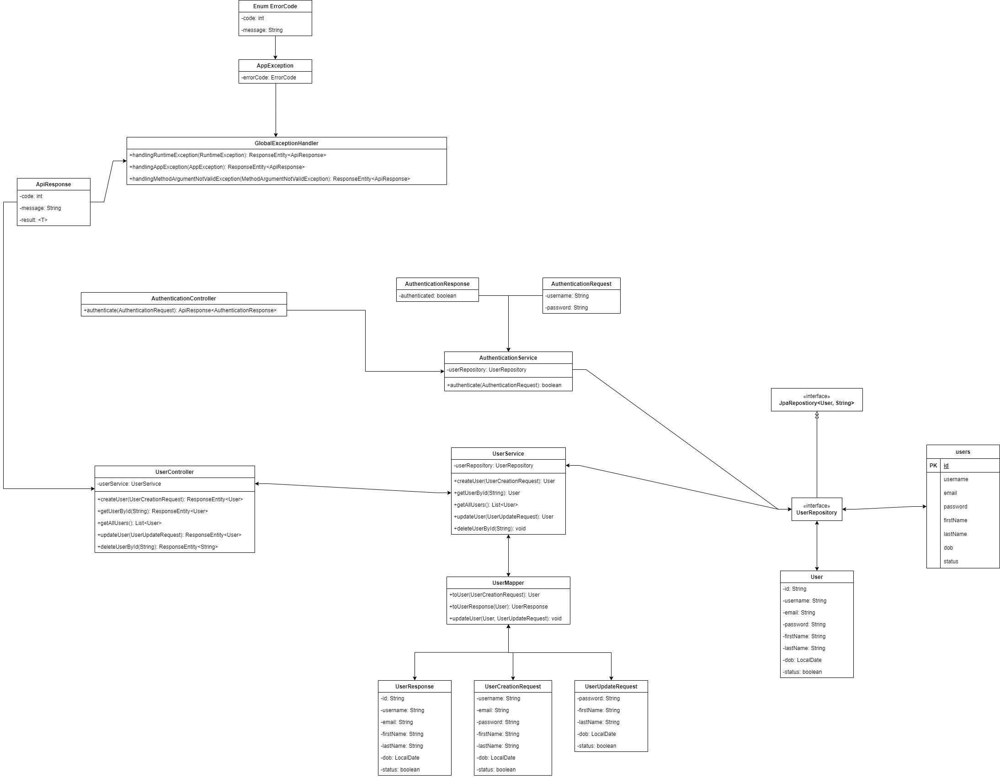

# Encrypt password and matching with Bcrypt

## Sơ đồ


## Cấu trúc thư mục

```bash
+---src
|   +---main
|   |   +---java
|   |   |   \---com
|   |   |       \---learnspringboot
|   |   |           \---identity_user
|   |   |               |   IdentityUserApplication.java
|   |   |               |
|   |   |               +---controller
|   |   |               |       AuthenticationController.java
|   |   |               |       UserController.java
|   |   |               |
|   |   |               +---dto
|   |   |               |   +---request
|   |   |               |   |       AuthenticationRequest.java
|   |   |               |   |       UserCreationRequest.java
|   |   |               |   |       UserUpdateRequest.java
|   |   |               |   |
|   |   |               |   \---response
|   |   |               |           ApiResponse.java
|   |   |               |           AuthenticationResponse.java
|   |   |               |           UserResponse.java
|   |   |               |
|   |   |               +---entity
|   |   |               |       User.java
|   |   |               |
|   |   |               +---exception
|   |   |               |       AppException.java
|   |   |               |       ErrorCode.java
|   |   |               |       GlobalExceptionHandler.java
|   |   |               |
|   |   |               +---mapper
|   |   |               |       UserMapper.java
|   |   |               |
|   |   |               +---repository
|   |   |               |       UserRepository.java
|   |   |               |
|   |   |               \---service
|   |   |                       AuthenticationService.java
|   |   |                       UserService.java
|   |   |
|   |   \---resources
|   |       |   application.yml
|   |       |
|   |       +---static
|   |       \---templates
```

## Dependencies

* Spring Web
* Spring Data JPA
* MySQL Driver
* OpenAPI
* Lombok
* Mapstruct
* Lombok Binding Mapstruct
* Spring Security Crypto (Thêm mới)

## Đặt vấn đề

Trước đây ta sẽ hay dùng MD5 để mã hóa mật khẩu.

MD5 (Message-Digest Algorithm 5) là một thuật toán băm phổ biến, nhưng khi sử dụng để mã hóa mật khẩu, nó có nhiều nhược điểm nghiêm trọng:

* **Không An Toàn**: MD5 không còn được xem là an toàn cho việc mã hóa mật khẩu vì nó dễ bị tấn công bằng cách sử dụng các công cụ như rainbow tables hoặc brute force. Các lỗ hổng bảo mật đã được phát hiện cho phép tạo ra các va chạm (collisions), nghĩa là hai đầu vào khác nhau có thể tạo ra cùng một băm.

* **Tốc Độ Cao**: MD5 được thiết kế để hoạt động nhanh, điều này là bất lợi khi mã hóa mật khẩu vì nó cho phép các cuộc tấn công brute force hoặc dictionary attacks thực hiện nhanh chóng.

* **Không Có Salt**: MD5 không tích hợp cơ chế sử dụng salt (một chuỗi ngẫu nhiên được thêm vào mật khẩu trước khi băm) để chống lại các cuộc tấn công từ các rainbow tables. Salt là một yếu tố quan trọng trong việc bảo mật mật khẩu vì nó làm cho mỗi băm trở nên độc nhất, ngay cả khi mật khẩu giống nhau.

* **Không Linh Hoạt**: MD5 thiếu khả năng điều chỉnh độ phức tạp tính toán (cost factor) để tăng cường bảo mật trong tương lai khi sức mạnh tính toán của phần cứng tăng lên.

## Giải pháp

**Sử Dụng Bcrypt Trong Java**

Bcrypt là một thuật toán mã hóa mật khẩu mạnh mẽ được thiết kế để giải quyết các nhược điểm của MD5. Bcrypt tích hợp cơ chế sử dụng salt và cho phép điều chỉnh độ phức tạp tính toán. Dưới đây là một số lợi ích chính của việc sử dụng Bcrypt:

* **Bảo Mật Cao**: Bcrypt được thiết kế để kháng lại các cuộc tấn công brute force và dictionary attacks. Nó sử dụng một chuỗi salt ngẫu nhiên và lưu cả salt và băm trong cơ sở dữ liệu.

* **Điều Chỉnh Được Độ Phức Tạp (Cost Factor)**: Bcrypt cho phép điều chỉnh độ phức tạp tính toán, có nghĩa là bạn có thể tăng độ phức tạp theo thời gian để bù đắp cho sự gia tăng sức mạnh tính toán của phần cứng.

* **Salt Tự Động**: Bcrypt tự động sinh ra một chuỗi salt ngẫu nhiên cho mỗi lần mã hóa, làm cho các băm mật khẩu khác nhau ngay cả khi mật khẩu gốc giống nhau.

## Áp dụng giải pháp

Đầu tiên ta cần thêm dependency của spring security core vào file `pom.xml`:

```xml
<dependency>
    <groupId>org.springframework.security</groupId>
    <artifactId>spring-security-crypto</artifactId>
    <version>6.2.1</version>
</dependency>
```

Tiếp theo ta tạo ra class `AuthenticationRequest`, đây là request khi đăng nhập, chỉ có `username` và `password`:

```java
@Data
@Builder
@AllArgsConstructor
@NoArgsConstructor
@FieldDefaults(level = AccessLevel.PRIVATE)
public class AuthenticationRequest {
    String username;
    String password;
}
```

Có request rồi thì phải có response, ta tạo thêm `AuthenticationResponse`. Response này trả về kết quả dạng `boolean`:

```java
@Data
@Builder
@AllArgsConstructor
@NoArgsConstructor
@FieldDefaults(level = AccessLevel.PRIVATE)
public class AuthenticationResponse {
    boolean authenticated;
}
```

Bước tiếp theo ta sẽ sửa lại một chút ở `UserService`, trong phương thức khởi tạo trước khi lưu vào database, ta sẽ mã hóa mật khẩu.

Chúng ta sẽ sử dụng lớp `PasswordEncoder` để thực hiện việc mã hóa:

```java
@Service
@RequiredArgsConstructor
@FieldDefaults(level = AccessLevel.PRIVATE, makeFinal = true)
public class UserService {

    // Các denpendency injection

    // Create
    public UserResponse createUser(UserCreationRequest request) {

        if (userRepository.existsByUsername(request.getUsername())) {
            throw new AppException(ErrorCode.USER_EXISTED);
        }

        if (userRepository.existsByEmail(request.getUsername())) {
            throw new AppException(ErrorCode.EMAIL_EXISTED);
        }

        User user = userMapper.toUser(request);

        // Mã hóa mật khẩu
        PasswordEncoder passwordEncoder = new BCryptPasswordEncoder(10);

        user.setPassword(passwordEncoder.encode(request.getPassword()));

        return userMapper.toUserResponse(userRepository.save(user));
    }

    // Các phương thức khác
}
```

Rồi đến `AuthenticationService`, ở đây ta sẽ dùng `PasswordEncoder` với phương thức `matches()` để kiểm tra xem mật khẩu từ `request` và mật khẩu trong database có giống nhau không:

```java
@Service
@RequiredArgsConstructor
@FieldDefaults(level = AccessLevel.PRIVATE, makeFinal = true)
public class AuthenticationService {
    UserRepository userRepository;

    public boolean authenticate(AuthenticationRequest request){
        var user = userRepository.findByUsername(request.getUsername())
                    .orElseThrow(() -> new AppException(ErrorCode.USER_NOT_FOUND));

        PasswordEncoder passwordEncoder = new BCryptPasswordEncoder(10);

        return passwordEncoder.matches(request.getPassword(), user.getPassword());
    }
}
```

Và cuối cùng là `AuthenticationController`:

```java
@RestController
@RequestMapping("/auth")
@RequiredArgsConstructor
@FieldDefaults(level = AccessLevel.PRIVATE, makeFinal = true)
public class AuthenticationController {
    AuthenticationService authenticationService;
    
    @PostMapping("/log-in")
    public ApiResponse<AuthenticationResponse> authenticate(@RequestBody AuthenticationRequest request) {
        boolean result = authenticationService.authenticate(request);
    
        return ApiResponse.<AuthenticationResponse>builder()
                .result(AuthenticationResponse.builder()
                            .authenticated(result)
                            .build())
                .build();
    }
    
}
```