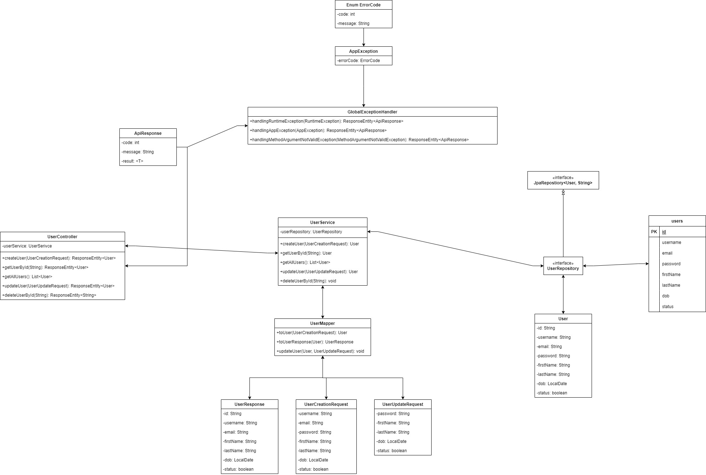

# Sử dụng lombok và mapstruct

## Sơ đồ



## Cấu trúc thư mục

```bash
+---src
|   +---main
|   |   +---java
|   |   |   \---com
|   |   |       \---learnspringboot
|   |   |           \---identity_user
|   |   |               |   IdentityUserApplication.java
|   |   |               |
|   |   |               +---controller
|   |   |               |       UserController.java
|   |   |               |
|   |   |               +---dto
|   |   |               |   +---request
|   |   |               |   |       UserCreationRequest.java
|   |   |               |   |       UserUpdateRequest.java
|   |   |               |   |
|   |   |               |   \---response
|   |   |               |           ApiResponse.java
|   |   |               |           UserResponse.java
|   |   |               |
|   |   |               +---entity
|   |   |               |       User.java
|   |   |               |
|   |   |               +---exception
|   |   |               |       AppException.java
|   |   |               |       ErrorCode.java
|   |   |               |       GlobalExceptionHandler.java
|   |   |               |
|   |   |               +---mapper
|   |   |               |       UserMapper.java
|   |   |               |
|   |   |               +---repository
|   |   |               |       UserRepository.java
|   |   |               |
|   |   |               \---service
|   |   |                       UserService.java
|   |   |
|   |   \---resources
|   |       |   application.yml
|   |       |
|   |       +---static
|   |       \---templates
|   \---test
|       \---java
|           \---com
|               \---learnspringboot
|                   \---identity_user
|                           IdentityUserApplicationTests.java
```

## Dependencies

* Spring Web
* Spring Data JPA
* MySQL Driver
* OpenAPI
* Lombok
* Mapstruct
* Lombok Binding Mapstruct

## Lombok

### Đặt vấn đề
Lombok là một thư viện Java giúp giảm bớt mã boilerplate bằng cách tự động sinh ra các phương thức getter, setter, equals, hashCode, toString, constructors và nhiều hơn nữa thông qua các annotation. Khi không sử dụng Lombok, các nhà phát triển phải viết tay tất cả những mã này, dẫn đến một số vấn đề sau:

* Mã Boilerplate Dài Dòng: Viết tay các phương thức getter, setter, constructors, equals, hashCode, và toString cho mỗi lớp làm tăng đáng kể lượng mã nguồn. Điều này không chỉ làm tăng kích thước của lớp mà còn làm cho mã trở nên khó đọc và duy trì hơn.

* Lỗi do Sao Chép và Dán: Khi phải viết nhiều mã lặp đi lặp lại, rất dễ mắc lỗi do sao chép và dán, chẳng hạn như thiếu cập nhật phương thức khi thêm hoặc xóa thuộc tính của lớp.

* Khó Duy Trì: Các lớp có nhiều thuộc tính sẽ trở nên khó duy trì vì mỗi lần thay đổi cấu trúc của lớp, bạn cần cập nhật tất cả các phương thức liên quan (getter, setter, equals, hashCode, toString, v.v.).

* Thời Gian Phát Triển Tăng: Viết và kiểm tra mã boilerplate chiếm nhiều thời gian, làm giảm hiệu quả phát triển phần mềm.

* Tăng Khối Lượng Công Việc Kiểm Thử: Mã boilerplate làm tăng khối lượng công việc kiểm thử vì bạn phải đảm bảo rằng các phương thức được viết tay hoạt động đúng cách và không chứa lỗi.

```java
public class UserCreationRequest {
    @Size(min = 3, message = "INVALID_USERNAME")
    private String username;
    @Email(message = "INVALID_EMAIL")
    private String email;
    @Size(min = 8, message = "INVALID_PASSWORD")
    private String password;
    private String firstName;
    private String lastName;
    private LocalDate dob;

    
    public UserCreationRequest(@Size(min = 3, message = "INVALID_USERNAME") String username,
            @Email(message = "INVALID_EMAIL") String email,
            @Size(min = 8, message = "INVALID_PASSWORD") String password, String firstName, String lastName,
            LocalDate dob) {
        this.username = username;
        this.email = email;
        this.password = password;
        this.firstName = firstName;
        this.lastName = lastName;
        this.dob = dob;
    }
    public String getUsername() {
        return username;
    }
    public void setUsername(String username) {
        this.username = username;
    }
    public String getEmail() {
        return email;
    }
    public void setEmail(String email) {
        this.email = email;
    }
    public String getPassword() {
        return password;
    }
    public void setPassword(String password) {
        this.password = password;
    }
    public String getFirstName() {
        return firstName;
    }
    public void setFirstName(String firstName) {
        this.firstName = firstName;
    }
    public String getLastName() {
        return lastName;
    }
    public void setLastName(String lastName) {
        this.lastName = lastName;
    }
    public LocalDate getDob() {
        return dob;
    }
    public void setDob(LocalDate dob) {
        this.dob = dob;
    }
    @Override
    public int hashCode() {
        final int prime = 31;
        int result = 1;
        result = prime * result + ((username == null) ? 0 : username.hashCode());
        result = prime * result + ((email == null) ? 0 : email.hashCode());
        result = prime * result + ((password == null) ? 0 : password.hashCode());
        result = prime * result + ((firstName == null) ? 0 : firstName.hashCode());
        result = prime * result + ((lastName == null) ? 0 : lastName.hashCode());
        result = prime * result + ((dob == null) ? 0 : dob.hashCode());
        return result;
    }
    @Override
    public boolean equals(Object obj) {
        if (this == obj)
            return true;
        if (obj == null)
            return false;
        if (getClass() != obj.getClass())
            return false;
        UserCreationRequest other = (UserCreationRequest) obj;
        if (username == null) {
            if (other.username != null)
                return false;
        } else if (!username.equals(other.username))
            return false;
        if (email == null) {
            if (other.email != null)
                return false;
        } else if (!email.equals(other.email))
            return false;
        if (password == null) {
            if (other.password != null)
                return false;
        } else if (!password.equals(other.password))
            return false;
        if (firstName == null) {
            if (other.firstName != null)
                return false;
        } else if (!firstName.equals(other.firstName))
            return false;
        if (lastName == null) {
            if (other.lastName != null)
                return false;
        } else if (!lastName.equals(other.lastName))
            return false;
        if (dob == null) {
            if (other.dob != null)
                return false;
        } else if (!dob.equals(other.dob))
            return false;
        return true;
    }
    @Override
    public String toString() {
        return "UserCreationRequest [username=" + username + ", email=" + email + ", password=" + password
                + ", firstName=" + firstName + ", lastName=" + lastName + ", dob=" + dob + "]";
    }   
}
```

Dài quá dài, hơn 100 dòng code chỉ để có những phương thức cần và đủ cho một class. Đây là `User` mới chỉ có vài thuộc tính, chứ nếu mà có tới hơn 10 thuộc tính thì số phương thức này còn nhiều hơn.

### Giải pháp

Thêm dependency của lombok vào file `pom.xml`:

```xml
<dependency>
    <groupId>org.projectlombok</groupId>
    <artifactId>lombok</artifactId>
    <optional>true</optional>
</dependency>
```

Nhờ có Lombok, chúng ta sẽ chỉ cần các annotation như dưới đây:

```java
@Data
@Builder
@AllArgsConstructor
@NoArgsConstructor
public class UserCreationRequest {
    @Size(min = 3, message = "INVALID_USERNAME")
    private String username;
    @Email(message = "INVALID_EMAIL")
    private String email;
    @Size(min = 8, message = "INVALID_PASSWORD")
    private String password;
    private String firstName;
    private String lastName;
    private LocalDate dob;
}
```

Giải thích:

* `@Data` là annotation đã bao gồm các annotation như `@Getter`, `@Setter`, `@RequiredArgsConstructor`, `@ToString`, `@EqualsAndHashCode`.

* `@Builder` giúp ta tạo instance của class một cách nhanh gọn hơn.

* `@AllArgsConstructor` triển khai phương thức khởi tạo với tất cả thuộc tính.

* `@NoArgsConstructor` triển khai phương thức khởi tạo không thuộc tính.

Với các annotation ở trên, Lombok sẽ giúp chúng ta tạo ra các phương thức getter, setter, constructor, v.v... như bình thường.

*Bạn có thể kiểm tra các phương thức này trong file `User.class` tại `/target`.*

Tiếp theo, các thuộc tính của class đều là `private`, vậy thì ta có thể sử dụng annotation `@FieldDefaults(level = AccessLevel.PRIVATE)` để đánh dấu tất cả thuộc tính của class là `private` một cách mặc định:

```java
@Data
@Builder
@AllArgsConstructor
@NoArgsConstructor
@FieldDefaults(level = AccessLevel.PRIVATE)
public class UserCreationRequest {
    @Size(min = 3, message = "INVALID_USERNAME")
    String username;

    @Email(message = "INVALID_EMAIL")
    String email;

    @Size(min = 8, message = "INVALID_PASSWORD")
    String password;
    
    String firstName;
    String lastName;
    LocalDate dob;
}
```

## Mapstruct

### Đặt vấn đề

Trong các ứng dụng Java, đặc biệt là các ứng dụng doanh nghiệp, việc chuyển đổi (ánh xạ) giữa các loại đối tượng khác nhau là rất phổ biến. Ví dụ, khi làm việc với dữ liệu từ cơ sở dữ liệu, bạn thường cần chuyển đổi giữa các đối tượng thực thể (entity) và các đối tượng truyền dữ liệu (DTO). Việc này thường yêu cầu viết rất nhiều mã lặp đi lặp lại và dễ gây ra lỗi, đặc biệt là khi các lớp đối tượng có nhiều thuộc tính hoặc cấu trúc phức tạp.

Một số vấn đề phổ biến bao gồm:

* Mã lặp đi lặp lại: Mã chuyển đổi giữa các đối tượng thường phải viết tay và rất lặp đi lặp lại, dễ gây nhầm lẫn và khó duy trì.

* Lỗi trong quá trình ánh xạ: Việc viết tay mã chuyển đổi có thể dẫn đến lỗi, chẳng hạn như quên ánh xạ một thuộc tính hoặc ánh xạ sai kiểu dữ liệu.

* Hiệu suất: Các công cụ ánh xạ thời gian chạy có thể gây overhead và làm giảm hiệu suất của ứng dụng.

* Khó kiểm tra: Mã chuyển đổi thường khó kiểm tra và gỡ lỗi, vì vậy rất khó để đảm bảo tính đúng đắn của việc ánh xạ.

```java
public User createUser(UserCreationRequest request) {

// Các đoạn code khác

    User user = User.builder()
        .username(request.getUsername())
        .email(request.getEmail())
        .password(request.getPassword())
        .firstName(request.getFirstName())
        .lastName(request.getLastName())
        .dob(request.getDob())
        .build();
    
        return userRepository.save(user);
}
```

Hoặc như khi muốn update `User` thì ta set giá trị cho từng thuộc tính của `User` dựa trên dữ liệu của `UserUpdateRequest`:

```java
public User updateUser(String id, UserUpdateRequest request) {
    User updateUser = getUserById(id);

    updateUser.setPassword(request.getPassword());
    updateUser.setFirstName(request.getFirstName());
    updateUser.setLastName(request.getLastName());
    updateUser.setDob(request.getDob());

    return userRepository.save(updateUser);
}
```

Vấn đề ở đây là, nếu đối tượng chỉ có vài thuộc tính thì không sao, nhưng nếu lên cả chục thuộc tính thì phương thức của chúng ta rất là dài.

### Giải pháp

`MapStruct` là một công cụ ánh xạ giúp giải quyết các vấn đề nêu trên bằng cách tự động sinh mã chuyển đổi tại thời điểm biên dịch. Dưới đây là cách MapStruct giải quyết các vấn đề trên:

Thêm dependency của `Mapstruct` vào `pom.xml`:

```xml
...
<properties>
    <org.mapstruct.version>1.5.5.Final</org.mapstruct.version>
</properties>
...
<dependencies>
    <dependency>
        <groupId>org.mapstruct</groupId>
        <artifactId>mapstruct</artifactId>
        <version>${org.mapstruct.version}</version>
    </dependency>
</dependencies>
...
<build>
    <plugins>
        <plugin>
            <groupId>org.apache.maven.plugins</groupId>
            <artifactId>maven-compiler-plugin</artifactId>
            <version>3.8.1</version>
            <configuration>
                <source>1.8</source> <!-- depending on your project -->
                <target>1.8</target> <!-- depending on your project -->
                <annotationProcessorPaths>
                    <path>
                        <groupId>org.mapstruct</groupId>
                        <artifactId>mapstruct-processor</artifactId>
                        <version>${org.mapstruct.version}</version>
                    </path>
                    <!-- other annotation processors -->
                </annotationProcessorPaths>
            </configuration>
        </plugin>
    </plugins>
</build>
```

Bình thường thì service layer không nên trả về dữ liệu của `entity` mà phải là repository layer. Vậy nên ta cần tạo ra một class `UserResponse` để service layer có thể trả dữ liệu về:

```java
@Data
@NoArgsConstructor
@AllArgsConstructor
@Builder
@FieldDefaults(level = AccessLevel.PRIVATE)
public class UserResponse {
    @Id
    @GeneratedValue(strategy = GenerationType.UUID)
    String id;
    String username;
    String email;
    String password;
    String firstName;
    String lastName;
    LocalDate dob;    
    boolean status;
}
```

Ta tạo thêm class `UserMapper` để ánh xạ dữ liệu:

```java
@Mapper(componentModel = "spring")
public interface UserMapper {
    User toUser(UserCreationRequest request);
    UserResponse toUserResponse(User user);
    void updateUser(@MappingTarget User user, UserUpdateRequest request);
}
```

Tất cả các phương thức trong `UserService` mà trả về `User` thì phải đổi thành `UserResponse`:

```java
public class UserService {
    UserRepository userRepository;
    UserMapper userMapper;

    // CREATE
    public UserResponse createUser(UserCreationRequest request) {

        if (userRepository.existsByUsername(request.getUsername())) {
            throw new AppException(ErrorCode.USER_EXISTED);
        }

        if (userRepository.existsByEmail(request.getEmail())) {
            throw new AppException(ErrorCode.EMAIL_EXISTED);
        }

        User user = userMapper.toUser(request);

        return userMapper.toUserResponse(userRepository.save(user));
    }

    // READ

    public UserResponse getUserById(String id) {
        return userMapper.toUserResponse(userRepository.findById(id)
        .orElseThrow(() -> new AppException(ErrorCode.USER_NOT_FOUND)));
    }

    // UPDATE
    public UserResponse updateUser(String id, UserUpdateRequest request) {
        User user = userRepository.findById(id)
        .orElseThrow(() -> new AppException(ErrorCode.USER_NOT_FOUND));

        userMapper.updateUser(user, request);

        return userMapper.toUserResponse(userRepository.save(user));
    }
    
    public UserResponse changeStatusUser(String id, boolean status) {
        User user = userRepository.findById(id)
        .orElseThrow(() -> new AppException(ErrorCode.USER_NOT_FOUND));

        user.setStatus(status);

        return userMapper.toUserResponse(userRepository.save(user));
    }

    // Các phương thức khác
}
```

## Lombok và MapStruct

### Đặt vấn đề

Khi sử dụng Lombok và MapStruct cùng nhau, MapStruct có thể gặp khó khăn trong việc ánh xạ các trường của các đối tượng do Lombok tạo ra. Điều này xảy ra vì các phương thức getter, setter, builder, v.v. được tạo ra bởi Lombok tại thời điểm biên dịch, nhưng MapStruct cần những phương thức này để tồn tại khi nó tạo ra mã ánh xạ.

### Giải pháp

`lombok-binding-mapstruct` giải quyết vấn đề này bằng cách làm cho Lombok và MapStruct hoạt động cùng nhau một cách mượt mà. Nó cho phép MapStruct nhận biết được các phương thức được tạo ra bởi Lombok, từ đó tạo ra mã ánh xạ chính xác.

Bên cạnh đó ta cũng cần bổ sung dependency của `lombok-binding-mapstruct` :

```xml
<dependency>
    <groupId>org.projectlombok</groupId>
    <artifactId>lombok-mapstruct-binding</artifactId>
    <version>0.1.0</version>
</dependency>
```

## `@Autowired` 
### Đặt vấn đề

Trong Spring Framework, @Autowired thường được sử dụng để tiêm phụ thuộc (dependency injection) vào các thành phần của ứng dụng. Tuy nhiên, việc sử dụng @Autowired để tiêm phụ thuộc vào các trường (field injection) hoặc phương thức setter (setter injection) có thể gây ra một số vấn đề sau:

* Khó kiểm tra (Testing): Field injection và setter injection làm cho việc kiểm tra đơn vị (unit testing) trở nên phức tạp hơn vì các đối tượng giả (mock objects) cần phải được đặt bằng cách sử dụng reflection hoặc framework phụ trợ như Mockito.

* Không an toàn: Field injection và setter injection có thể dẫn đến các phụ thuộc chưa được khởi tạo, gây ra lỗi NullPointerException nếu các phụ thuộc này không được tiêm đúng cách.

* Không rõ ràng: Việc sử dụng field injection làm cho mã nguồn ít rõ ràng hơn vì các phụ thuộc không được khai báo trong constructor, gây khó khăn cho việc nhận biết các phụ thuộc của một lớp.

* Không bất biến (Immutability): Setter injection không thúc đẩy tính bất biến của các đối tượng vì các phụ thuộc có thể được thay đổi sau khi đối tượng được khởi tạo.

### Giải pháp

**Sử dụng Constructor Injection**

Constructor injection là một giải pháp tốt hơn cho việc tiêm phụ thuộc. Nó giúp giải quyết các vấn đề nêu trên và mang lại một số lợi ích:

* Dễ kiểm tra: Constructor injection làm cho việc kiểm tra đơn vị trở nên dễ dàng hơn vì bạn có thể tạo các đối tượng với các phụ thuộc giả một cách dễ dàng mà không cần sử dụng reflection.

* An toàn: Các phụ thuộc được đảm bảo được khởi tạo trước khi đối tượng được sử dụng, tránh lỗi NullPointerException.

* Rõ ràng: Các phụ thuộc được khai báo rõ ràng trong constructor, làm cho mã nguồn dễ đọc và dễ hiểu hơn.

* Bất biến: Constructor injection thúc đẩy tính bất biến của các đối tượng vì các phụ thuộc không thể thay đổi sau khi đối tượng được khởi tạo.

Ví dụ:

Khi dùng `@Autowired`:

```java
import org.springframework.beans.factory.annotation.Autowired;
import org.springframework.stereotype.Service;

@Service
public class UserService {

    @Autowired
    private UserRepository userRepository;

}
```

Khi dùng Constructor Injection:

```java
import org.springframework.stereotype.Service;

@Service
public class UserService {

    private final UserRepository userRepository;

    // Constructor injection
    public UserService(UserRepository userRepository) {
        this.userRepository = userRepository;
    }

}
``` 

Tuy nhiên, thay vì viết ra constructor injection như vậy, Lombok hỗ trợ chúng ta annotation `@RequiredRequiredArgsConstructor`.

Annotation này sẽ khởi tạo một constructor cho tất các biến mà ta định nghĩa là `final`.

Kết hợp với annotation `@FieldDefaults` ở trên, ta có:

```java 
import org.springframework.stereotype.Service;

import lombok.AccessLevel;
import lombok.RequiredArgsConstructor;
import lombok.experimental.FieldDefaults;

@Service
@RequiredArgsConstructor
@FieldDefaults(level = AccessLevel.PRIVATE, makeFinal = true)
public class UserService {

    UserRepository userRepository;

}
```

Và code của chúng ta ngắn và gọn hơn rất nhiều.