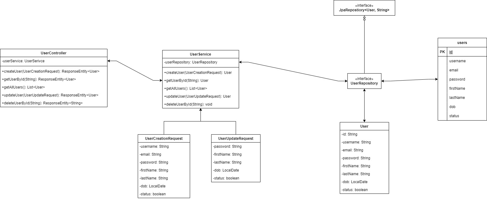

# Tạo CRUD API cơ bản

## Sơ đồ



## Tech stack

* Build tool: maven v3.9.6
* Java: v17
* Framework: Spring boot 3.3.x
* DBMS: MySQL

## Dependencies

* Spring Web
* Spring Data JPA
* MySQL Driver
* OpenAPI

## Cấu trúc thư mục

```cmd
    +---src
    |   +---main
    |   |   +---java
    |   |   |   \---com
    |   |   |       \---learnspringboot
    |   |   |           \---identity_user
    |   |   |               |   IdentityUserApplication.java
    |   |   |               |
    |   |   |               +---controller
    |   |   |               |       UserController.java
    |   |   |               |
    |   |   |               +---dto
    |   |   |               |   \---request
    |   |   |               |           UserCreationRequest.java
    |   |   |               |           UserUpdateRequest.java
    |   |   |               |
    |   |   |               +---entity
    |   |   |               |       User.java
    |   |   |               |
    |   |   |               +---repository
    |   |   |               |       UserRepository.java
    |   |   |               |
    |   |   |               \---service
    |   |   |                       UserService.java
    |   |   |
    |   |   \---resources
    |   |       |   application.yml
    |   |       |
    |   |       +---static
    |   |       \---templates
    |   \---test
    |       \---java
    |           \---com
    |               \---learnspringboot
    |                   \---identity_user
    |                           IdentityUserApplicationTests.java
```


## Cấu hình application

File application sẽ đổi thành đuôi mở rộng `.yml` hoặc `.yaml` vì viết theo cấu trúc như này dễ nhìn hơn.

```yml
server:
    port: 8082
    servlet:
        context-path: /identity

spring:
    datasource: 
        url: jdbc:mysql://localhost:3306/usersdb
        username: root
        password: abc123-
    jpa:
        hibernate:
            ddl-auto: update
        show-sql: true
```

Giải thích:

* `server`: Đây là phần cấu hình cho máy chủ ứng dụng.

  * `port: 8082`: Đặt cổng cho máy chủ chạy ứng dụng là 8082. Nghĩa là bạn có thể truy cập ứng dụng qua http://localhost:8082.

  * `servlet`: Phần cấu hình cho các servlet.

    * `context-path: /identity`: Đặt đường dẫn ngữ cảnh của ứng dụng là /identity. Tất cả các URL của ứng dụng sẽ bắt đầu bằng /identity. Ví dụ, nếu bạn có một endpoint /login, URL đầy đủ sẽ là http://localhost:8082/identity/login.

* `spring`: Đây là phần cấu hình cho Spring Framework.

  * `datasource`: Phần cấu hình kết nối cơ sở dữ liệu.

    * `url: jdbc:mysql://localhost:3306/usersdb`: Đặt URL kết nối đến cơ sở dữ liệu MySQL, ở đây cơ sở dữ liệu là usersdb chạy trên localhost ở cổng 3306.

    * `username: root`: Tên người dùng để kết nối với cơ sở dữ liệu là root.

    * `password: abc123-`: Mật khẩu để kết nối với cơ sở dữ liệu là abc123-.

  * `jpa`: Phần cấu hình cho Java Persistence API (JPA).

    * `hibernate`:

      * `ddl-auto: update`: Cấu hình Hibernate để tự động cập nhật cấu trúc cơ sở dữ liệu dựa trên các thay đổi trong các entity (thực thể) JPA. Các giá trị có thể là validate, update, create, create-drop.

  * `show-sql: true`: Khi đặt là true, JPA sẽ hiển thị các câu lệnh SQL được thực thi trong console, điều này hữu ích cho mục đích gỡ lỗi.

## Entity

Đầu tiên cần tạo đối tượng `User`:

```java
@Entity
@Table(name = "users")
public class User {
    @Id
    @GeneratedValue(strategy = GenerationType.UUID)
    private String id;
    private String username;
    private String email;
    private String password;
    private String firstName;
    private String lastName;
    private LocalDate dob;    
    private boolean status;

    // các phương thức getter, setter, constructor
}
```

## Repository

Tiếp theo là khởi tạo interface `UserRepository`

```java
@Repository
public interface UserRepository extends JpaRepository<User, String>{

}
```

## DTO

Trước khi tạo tầng dịch vụ (service layer), ta cần tạo ra DTO giúp tách biệt các tầng và bảo mật dữ liệu.

Ta sẽ tạo ra 2 DTO request tương ứng với `create` và `update` cho user.

### Create User

```java
public class UserCreationRequest {
    private String username;
    private String email;
    private String password;
    private String firstName;
    private String lastName;
    private LocalDate dob;    
    private boolean status;
}
```

### Update User

```java
public class UserUpdateRequest {
    private String password;
    private String firstName;
    private String lastName;
    private LocalDate dob;    
    private boolean status;
}
```

## Service

`UserService` sẽ có đủ 4 thành phần trong CRUD: `Create`, `Read`, `Update`, `Delete`

```java
public class UserService {
    @Autowired
    private UserRepository userRepository;

    // CREATE
    public User createUser(UserCreationRequest request) {
        User user = User.builder()
            .username(request.getUsername())
            .email(request.getEmail())
            .password(request.getPassword())
            .firstName(request.getFirstName())
            .lastName(request.getLastName())
            .dob(request.getDob())
            .status(request.isStatus())
            .build();

        return userRepository.save(user);
    }

    // READ
    public List<User> getAllUsers() {
        return userRepository.findAll();
    }

    public User getUserById(String id) {
        return userRepository.findById(id)
            .orElseThrow(() -> new RuntimeException("User not found."));
    }

    // UPDATE
    public User updateUser(String id, UserUpdateRequest request) {
        User user = getUserById(id);

        user.setPassword(request.getPassword());
        user.setFirstName(request.getFirstName());
        user.setLastName(request.getLastName());
        user.setDob(request.getDob());

        return userRepository.save(user);
    }
    
    public User changeStatusUser(String id, boolean status) {
        User user = getUserById(id);

        user.setStatus(status);

        return userRepository.save(user);
    }

    // DELETE
    public void deleteUser(String id) {
        userRepository.deleteById(id);
    }
}
```

## Controller

Tầng controller sẽ tạo ra các end point tương ứng cho các serivce ở trên.

```java
@RestController
@RequestMapping("/api/v1/users")
public class UserController {
    @Autowired
    private UserService userService;

    // CREATE
    @PostMapping
    public ResponseEntity<User> createUser(@RequestBody UserCreationRequest request ) {
        User user = userService.createUser(request);
        
        return new ResponseEntity<User>(user, HttpStatus.CREATED);
    }
    
    // READ
    @GetMapping
    public List<User> getAllUsers() {
        return userService.getAllUsers();
    }

    @GetMapping("/{userId}")
    public ResponseEntity<User> getUserById(@PathVariable String userId) {
        User user = userService.getUserById(userId);

        return new ResponseEntity<User>(user, HttpStatus.OK);
    }
    
    // UPDATE
    @PutMapping("/{userId}")
    public ResponseEntity<User> updateUser(@PathVariable String userId, @RequestBody UserUpdateRequest request) {
        User user = userService.updateUser(userId, request);
        
        return new ResponseEntity<User>(user, HttpStatus.ACCEPTED);
    }

    @PatchMapping("/{userId}")
    public ResponseEntity<User> changeUserStatus(@PathVariable String userId, @RequestParam("status") boolean status) {
        User user = userService.changeStatusUser(userId, status);

        return new ResponseEntity<User>(user, HttpStatus.OK);
    }

    // DELETE
    @DeleteMapping("/{userId}")
    public ResponseEntity<String> deleteUser(@PathVariable String userId) {
        userService.deleteUser(userId);

        return new ResponseEntity<>(HttpStatus.RESET_CONTENT);
    }
}
```